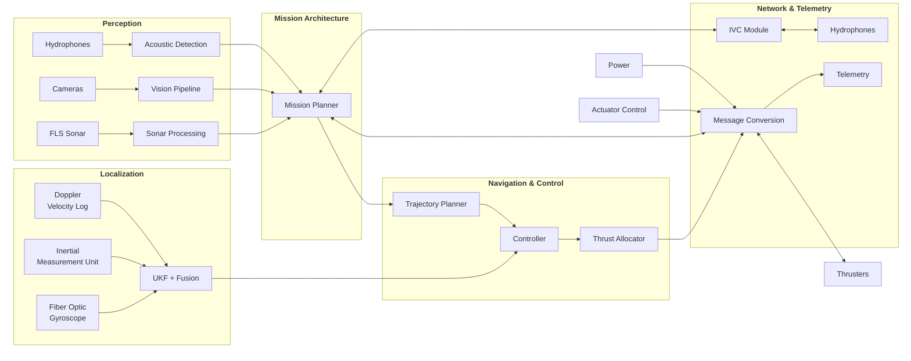
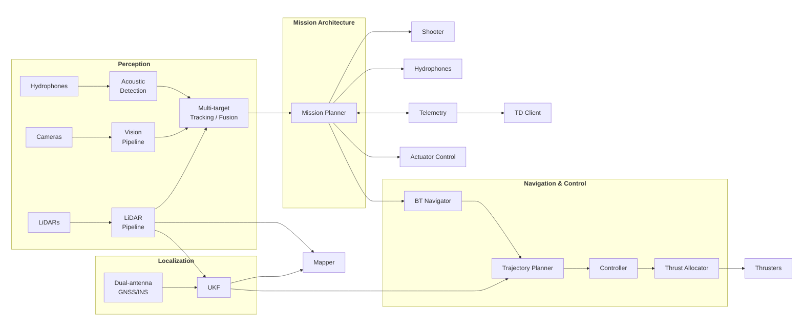
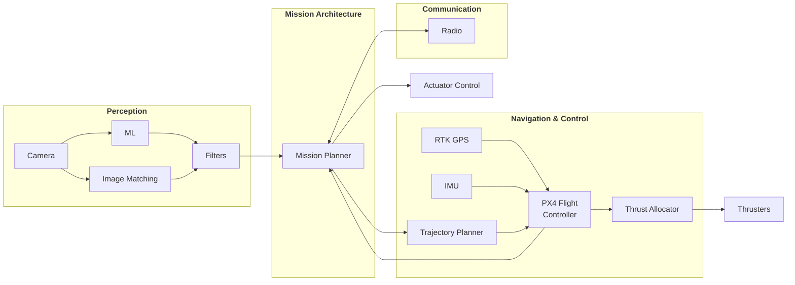

# BumblebeeAS Open Source

We build software for autonomous underwater, surface, and aerial robots. Our stack spans mission planning, perception, controls, simulation, sensor integration, and developer tooling.

## AUV architecture

## ASV architecture

## UAV architecture

## Getting Started

To view our software in action, see the [`BumblebeeAS/examples`](https://github.com/BumblebeeAS/examples) repository which contains end-to-end demos and quick-start instructions on how to set up your **ROS2 Humble** workspace.

The [software stack overview](stack.md#bumblebeeas-software-stack-overview) provides a reference of the individual Git repositories in our stack.

## Competitions

To see our approach in applying our software stack in competitions settings, see:

- [RoboSub25](robosub25.md#robosub-2025)
- *more to come ...*

## Contributing

Contributions are welcome!

Feel free to open an issue or pull request in the respective repository. We are also open to discussion on the RoboNation Community discord.
