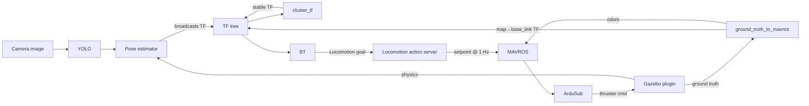

# Concepts

If this is your first underwater-robotics project, this page is a survival
glossary. Every other page assumes you've at least skimmed these terms.
Read it linearly. Each concept builds on the previous.

## ROS 2 in 90 seconds

The Robot Operating System (ROS) isn't an OS. It's a **middleware** for
distributed robot software. You run lots of small programs ("nodes")
that talk to each other over a network. ROS 2 is the second major
version; this workspace uses the **Humble** distribution.

The four communication primitives you'll see everywhere:

| Primitive | Shape | When to use | Example in this workspace |
|---|---|---|---|
| **Topic** | Pub / sub, one-way, streaming | High-rate data (images, IMU, odometry) | `/bluerov/odom`, `/bluerov/front_cam/image` |
| **Service** | Request / response, blocking, one-shot | "Convert X for me right now" | `/bluerov/convert_to_controls_pose` |
| **Action** | Request → feedback → result, long-running | "Drive to this pose; tell me when you arrive" | `/bluerov/controls` |
| **Parameter** | Key-value config on a node | Tuning at launch / runtime | `use_sim_time`, `camera_info_topic` |

!!! tip "How to inspect what's running"
    Inside the container:

    ```bash
    ros2 node list           # which nodes are alive
    ros2 topic list          # which topics exist
    ros2 topic hz <topic>    # how often is it being published
    ros2 topic echo <topic>  # print the messages
    ros2 service list
    ros2 action list
    ros2 param list /<node>  # parameters of one node
    ros2 run tf2_ros tf2_echo <parent> <child>  # check a TF
    ```

    These five commands solve ~80% of "why isn't this working" questions.

## Coordinate frames and TF

A **frame** is a 3D coordinate system attached to something. The world,
the robot's body, a camera, a torpedo panel. ROS tracks the
relationships between frames in a tree called **TF** (transform).

In this workspace:

| Frame | What it's attached to | Convention |
|---|---|---|
| `map` | The simulated world origin | ENU. `+x` east, `+y` north, `+z` up |
| `base_link` | The robot's body centre | FLU. `+x` forward, `+y` left, `+z` up |
| `front_cam_optical` | Front camera, looking forward | Standard ROS optical: `+z` out of lens |
| `bottom_cam_optical` | Bottom camera, looking down | Same |
| `bin/yolo`, `torpedo/yolo`, `Task04_Tagging_01_optical`, … | Detected objects | Set by the pose estimator that broadcasts them |

The TF tree at any moment lets you answer: "where is *this* point, expressed in *that* frame?". Without anyone hand-coding the maths.

!!! warning "Three frame conventions you must keep straight"
    | Name | `+x` | `+y` | `+z` |
    |---|---|---|---|
    | **ENU** (East, North, Up): world / `map` | east | north | **up** |
    | **NED** (North, East, Down): used by ArduSub internally | north | east | **down** |
    | **FLU** (Forward, Left, Up): vehicle / `base_link` | forward | left | up |

    A 2 m forward goal in FLU is `(2, 0, 0)`. In NED that same direction
    might be `(0, 2, 0)` if the vehicle faces east. Mixing them up is
    the single most common source of "the robot drove the wrong way"
    bugs. See [Conventions](conventions.md).

!!! info "Why a TF tree instead of just hand-coding offsets"
    Because vehicles rotate. The camera's pose relative to the world
    changes every tick. Asking "where is the bin in `base_link`?" is
    only useful if someone keeps the lookup table up to date. Which is
    what TF does, automatically, every time a publisher broadcasts a
    transform.

## Behaviour trees and py_trees

A **behaviour tree** (BT) is a structured way to write mission logic.
It's a tree of nodes; each tick, the root asks its children to run.
The two control-flow nodes you'll see most:

- **Sequence**: runs children left-to-right. Succeeds only if every
  child succeeded. Stops at the first failure.
- **Selector** (a.k.a. Fallback): runs children left-to-right. Succeeds
  as soon as any child succeeds. Used to express "try plan A; if it
  fails, try plan B."

Leaves do the actual work. Call a service, send an action goal, set a
blackboard key, wait, etc.

!!! info "Why a BT instead of a state machine?"
    State machines (FSMs) get tangled fast: every state needs explicit
    transitions to every recoverable state. BTs encode the same logic
    more compactly: a `Selector` is "try this, then try that"; a
    `Sequence` is "do these in order". Recovery shows up as
    selector-branches, not as N² transition arrows.

[**py_trees**](https://py-trees.readthedocs.io/) is the Python BT library
this workspace uses. **py_trees_ros** is its ROS-2 integration:
action-client helpers, blackboard subscribers, etc. You'll see
`py_trees.composites.Sequence`, `py_trees.composites.Selector`,
`py_trees.decorators.Retry`, etc. in mission code.

### `memory=True`. The one BT detail you must remember

`Sequence(memory=True)` and `Selector(memory=True)` remember which
child they're currently on. Without `memory=True`, every tick re-runs
from child 0. That breaks any leg that takes more than one tick (which
is all of them. `goto` legs take seconds).

**Always use `memory=True`** for sequences and selectors in this
workspace.

### The blackboard

py_trees has a shared key-value store called the **blackboard**.
Behaviours read and write keys to share state. E.g. one behaviour
estimates a pose, writes it to `/bluerov/torpedo/pose`, and a later
`goto.FromBlackboard` reads that key to build the goal.

In this workspace, **every mission key is namespaced** (`/bluerov/bins/...`,
`/bluerov/torpedo/...`) so the bin and torpedo trees can't clobber each
other's state.

## Anatomy of a "mission" in this workspace

```
1. tmuxp launches 5 panes per mission
2. Each pane runs a ros2 launch <something>.launch.py
3. The BT pane spins up the py_trees tree
4. Each tree leg either:
   - sends a Locomotion action goal (move)
   - calls a service (e.g. toggle a vision template)
   - reads/writes the blackboard
   - waits / retries / fails
5. The Locomotion action server translates each goal into MAVROS setpoints
6. MAVROS sends MAVLink to ArduSub SITL
7. ArduSub computes thruster commands and sends them through the
   ArduPilot Gazebo plugin
8. Gazebo simulates the thrusters and physics; that updates the model's
   position
9. ground_truth_to_mavros publishes the new position back as TF and
   odometry, closing the loop
```

The whole loop runs at ~1 Hz on the setpoint side and 10 Hz on the BT
side. Slow enough that you can watch it tick.

## MAVROS, MAVLink, ArduSub, SITL. What are they?

This workspace simulates a **BlueROV2**, an off-the-shelf ROV that runs
**ArduSub** firmware. Real BlueROV2 hardware uses the same firmware. So
the simulation talks to the firmware exactly the way a real vehicle
would.

| Term | What it is |
|---|---|
| **ArduPilot** | The open-source autopilot project (planes, copters, ROVs). |
| **ArduSub** | ArduPilot's flavour for underwater vehicles. The actual firmware running on the BlueROV2. |
| **SITL** (Software-in-the-Loop) | A native build of the firmware that runs on your PC instead of on the autopilot board. Same code, different target. We use `ArduSub SITL`. |
| **MAVLink** | The lightweight serial protocol the firmware speaks. Used over UDP in sim. |
| **MAVROS** | A ROS package that translates MAVLink ↔ ROS. So mission code in ROS doesn't have to speak MAVLink directly. |
| **GUIDED mode** | ArduPilot's flight mode that accepts position-setpoint commands. The mission code arms the vehicle and switches it to GUIDED before sending setpoints. |

The hard rule: **mission code only talks to MAVROS**: never directly
to ArduSub or Gazebo. That's what makes the same mission code work on
the real vehicle.

## Gazebo and the ArduPilot Gazebo plugin

**Gazebo** is the physics simulator. We use **Gazebo Harmonic** (one of
the new "gz-sim" releases. Not the old gazebo-classic).

The ArduPilot Gazebo plugin is a Gazebo system plugin that **bridges
ArduSub SITL ↔ Gazebo** over a JSON / UDP protocol. ArduSub sends
desired thruster outputs; Gazebo sends back sensor data and the
vehicle's true pose.

You'll never edit this plugin yourself, but you should know it exists:
when "the vehicle is in Gazebo but ArduSub thinks it's disconnected",
this plugin is almost always the suspect.

## Vision. YOLO, pose estimators, point correspondences

In RoboSub, you have to find competition targets visually. The
detection pipeline in this workspace:

1. **YOLO** ([yolo_ros_trt](../packages/yolo_ros_trt.md)): neural net
   that finds objects in camera images. Outputs 2D bounding boxes /
   segmentation masks.
2. **Pose estimator** ([pose_estimator](../packages/pose_estimator.md)):
   takes the 2D YOLO output plus the camera intrinsics and runs PnP
   (Perspective-n-Point) to produce a 3D pose of the object. Broadcasts
   the pose as a **TF frame** (so the rest of the system can use it).
3. **Image matching** ([image_matching](../packages/image_matching.md)):
   matches a specific template image (e.g.
   `Task04_Tagging_01.png`) against the camera frame using XFeat. Sends
   "here are the 2D ↔ 3D point correspondences" to a separate pose
   estimator that produces another TF.
4. **Cluster_tf** ([filters](../packages/filters.md)): collects a few
   seconds of noisy per-frame TFs and outputs a single stable averaged
   TF. The BT consumes this stable TF rather than the jittery raw one.

!!! tip "Mental model: vision is just another TF broadcaster"
    From the BT's perspective, vision = "some other process is
    broadcasting a TF that gives me the target's 3D pose". The BT
    doesn't care whether it came from YOLO + PnP, template matching, a
    fiducial marker, or sonar. As long as a TF appears in the tree
    with the right name, the BT can plan around it.

## Cluster_tf. What does "clustering" actually do?

A pose estimator broadcasts a new TF every frame (often 30 Hz).
Detections are noisy. The pose jitters by centimetres frame-to-frame.
You don't want to drive a 2.5-cm-tolerance alignment off a jittery
single-frame estimate.

`cluster_tf` buffers a few seconds of TFs, runs HDBSCAN on the
positions to throw out outliers (e.g. detections from before the
vehicle yawed to face the panel), and broadcasts the average of the
largest inlier cluster as a single new TF. The BT then uses *that*.

| Input | Output |
|---|---|
| `torpedo/yolo`. Noisy, 30 Hz | `torpedo/yolo/clustered`. Stable, single TF |
| `bin/yolo`. Noisy, 30 Hz | `bin/yolo/clustered`. Stable, single TF |

You only see the input source frames when their broadcaster is alive
*and* publishing. Missing input = clustering fails with "0 valid
transforms collected".

## Anchor frames

Most goals in this workspace are "drive to a target pose". But which
part of the robot do you want **on** the target? The body centre? The
dropper? The shooter? The camera?

That's what an **anchor frame** answers. `goto` takes an
`anchor_frame_name` parameter; the conversion service shifts the
commanded pose so the anchor (not `base_link`) lands on the target.

- `anchor_frame_name="base_link"` (default): body centre on target.
- `anchor_frame_name="dropper_link"`. Drop opening on target. Used by
  bin.
- `anchor_frame_name="torpedo_shooter_left_link"`. Left shooter on
  target. Used by torpedo.
- `anchor_frame_name="front_cam_optical"`. Camera lens on target.
  Used to "look at" something rather than "arrive at" it.

## Sim time vs wall time

Gazebo publishes `/clock`. A simulated wall clock that ticks with the
simulation, not with your computer's real-time clock. Most ROS nodes
in this workspace are set with `use_sim_time: true` so timestamps on
TFs and topics all share that simulated clock.

If you forget `use_sim_time: true` on a node, it'll stamp its messages
with real wall time (seconds since 1970 = ~1.78e9), while everyone
else is on Gazebo time (~7000). The two never line up → every
synchronisation is broken → things look mysteriously frozen.

## How everything connects, one more time



The arrows close into a loop. That's the closed-loop control system
the mission code is sitting on top of.

## Where to go next

- **[Architecture](architecture.md)**: the same diagram but with
  per-layer responsibilities and contracts.
- **[Running the sim](running.md)**: copy-paste commands to actually
  launch everything.
- **[Conventions](conventions.md)**: frames, signs, units, naming
  rules.
- **[Strategies](../strategies/index.md)**: what each mission
  actually does, leg by leg.
