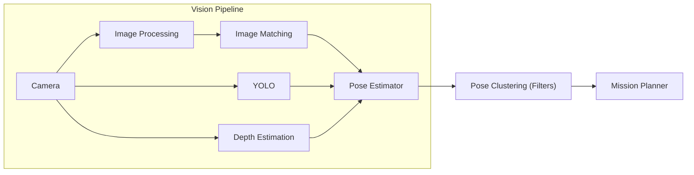

# BumblebeeAS Software Stack Overview

## Shared Interfaces and Mission Planning

| Repository                                                                          | What it does                                                                  |
| ----------------------------------------------------------------------------------- | ----------------------------------------------------------------------------- |
| [`bb_msgs`](https://github.com/BumblebeeAS/bb_msgs)                                 | Shared ROS messages, services, and actions.                                   |
| [`frames`](https://github.com/BumblebeeAS/frames)                                   | Compile-time frame types to make coordinate conversions safer.                |
| [`mission_planner_release`](https://github.com/BumblebeeAS/mission_planner_release) | py_trees-based mission-planning stack and reusable behaviour-tree primitives. |

## Perception

| Repository                                                                          | What it does                                                  |
| ----------------------------------------------------------------------------------- | ------------------------------------------------------------- |
| [`accelerated_features`](https://github.com/BumblebeeAS/accelerated_features)       | XFeat implementation for fast local feature extraction.       |
| [`depth-anything-tensorrt`](https://github.com/BumblebeeAS/depth-anything-tensorrt) | TensorRT inference for Depth Anything V1 and V2.              |
| [`filters`](https://github.com/BumblebeeAS/filters)                                 | Detection filtering and pose clustering for stable targets.   |
| [`image_matching`](https://github.com/BumblebeeAS/image_matching)                   | Local-feature matching against known targets.                 |
| [`image_processing`](https://github.com/BumblebeeAS/image_processing)               | ROS 2 utilities for image enhancement and timestamp handling. |
| [`pose_estimator`](https://github.com/BumblebeeAS/pose_estimator)                   | Vision-based 6-DoF target-pose estimation and TF publication. |
| [`vision_pipeline`](https://github.com/BumblebeeAS/vision_pipeline)                 | Launch files and utilities for orchestrating vision nodes.    |
| [`yolo_ros_trt`](https://github.com/BumblebeeAS/yolo_ros_trt)                       | ROS 2 object-detection wrapper for YOLO and TensorRT.         |

## Simulation

| Repository                                                  | What it does                                                 |
| ----------------------------------------------------------- | ------------------------------------------------------------ |
| [`ardusub_sim`](https://github.com/BumblebeeAS/ardusub_sim) | ArduSub and Gazebo simulation, built on Project DAVE.        |
| [`bb_worlds`](https://github.com/BumblebeeAS/bb_worlds)     | Gazebo worlds and assets for vehicles and competition tasks. |

## Developer platforms and tooling

| Repository                                                                                        | What it does                                                   |
| ------------------------------------------------------------------------------------------------- | -------------------------------------------------------------- |
| [`controlkitv3`](https://github.com/BumblebeeAS/controlkitv3)                                     | Foxglove-based interface for vehicle control and telemetry.    |
| [`isaac-ros-docker`](https://github.com/BumblebeeAS/isaac-ros-docker)                             | Docker tooling for Isaac ROS on legacy JetPack 6 Orin systems. |
| [`release`](https://github.com/BumblebeeAS/release)                                               | Source for this documentation site and public release notes.   |
| [`ros-humble-noetic-bridge`](https://github.com/BumblebeeAS/ros-humble-noetic-bridge)             | Ready-to-use bridge between ROS Noetic and ROS 2 Humble.       |
| [`ros-humble-ros1-bridge-builder`](https://github.com/BumblebeeAS/ros-humble-ros1-bridge-builder) | Builder for producing a Humble–ROS 1 bridge package.           |
