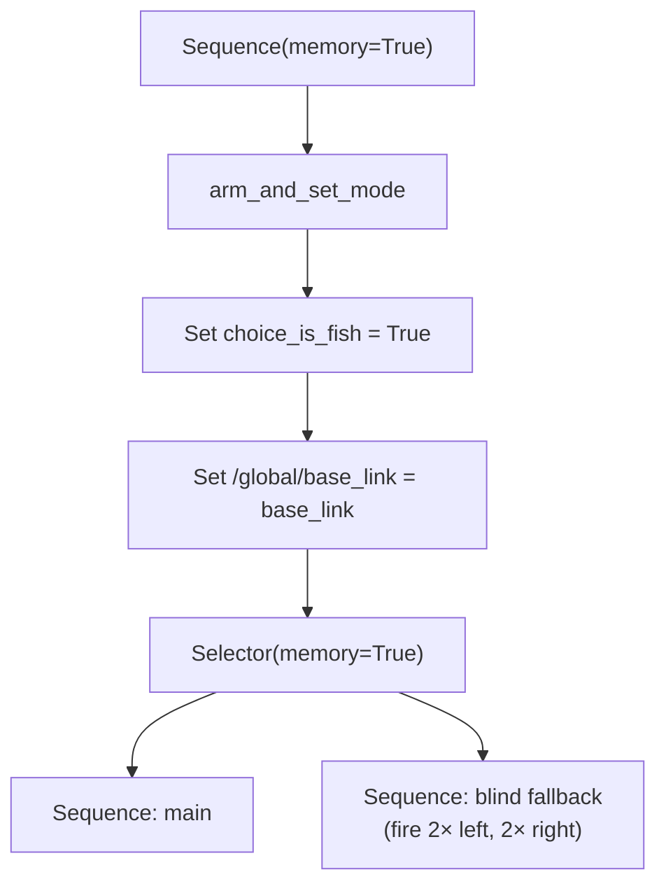

# Torpedo mission

The torpedo task is the most intricate mission in the workspace. Two
torpedo panels hang on the pool wall, each printed with a picture of
either a fish or a shark. The vehicle has to find both panels, decide
which picture sits where, line up a torpedo shooter on each one's
correct hole, and fire two torpedoes in sequence. Each torpedo that
passes through the correct hole scores points. A blind fallback fires
both torpedoes from the centre pose if everything else fails.

This mission lives in `bluerov_sim/bluerov_sim/torpedo/torpedo.py`,
with the per-panel move-and-shoot generator in
`bluerov_sim/bluerov_sim/torpedo/move_and_shoot_seq.py` and the
template-correspondence check in
`bluerov_sim/bluerov_sim/torpedo/point_correspondences_check.py`. It
reuses the front-yaw search builder from
`bluerov_sim/bluerov_sim/shared_trees/search.py`.

!!! tip "Pre-reading"
    - [Concepts](../overview/concepts.md): cluster_tf, anchor frames,
      sim time, TF tree.
    - [Primitives](primitives.md). `goto`, the search builders, the
      action server.
    - [Bin mission](bin.md): the same overall skeleton with fewer
      anchor swaps. Read it first if you haven't already.

## What "fish vs shark" actually means

The RoboSub torpedo panel has **four holes**, arranged 2 × 2. Each
panel shows a picture; that picture defines which hole counts as the
"fish hole" and which as the "shark hole" on each panel. The mission's
job is:

- Find both panels.
- Identify which panel is which (template 1 vs template 2).
- For each panel, decide whether you're shooting at the fish or shark
  hole (`choice_is_fish`. Currently hardcoded; see [gotchas](#subtle-gotchas)).
- Fire a torpedo through that hole on each panel.

So the BT shoots **two torpedoes total**: one per panel. At one
hole per panel. `SHOOT_REPEATS=2` means each shot is *fired twice* (a
quick double-tap for reliability), not that both holes get shot.

## Tree overview

`bluerov_sim/bluerov_sim/torpedo/torpedo.py:473–484`. Top-level
`Sequence(memory=True)`. It pre-seeds two blackboard keys
(`choice_is_fish`, `/global/base_link`) and then enters a
`Selector(memory=True)` of main vs blind fallback.



!!! info "Why pre-seed `/global/base_link`?"
    Some shared helpers (notably in `shared_trees/`) read
    `/global/base_link` as a blackboard key rather than hardcoding the
    string. Pre-seeding it at the top of the root sequence ensures the
    key exists by the time any child behaviour reads it. Without it,
    those helpers `KeyError` on first read.

### Main sequence. The 11 steps

1. **Bring up the vision pipeline.** Lifecycle-manager configures and
   activates the two YOLO nodes (panel detector + hole tracker).
2. **Drive to the torpedo vicinity.** A pose ~1.5 m south of the
   panels, yawed to face them (`yaw=90°` in the `map` ENU frame,
   facing `+y` / north). This is upstream of any perception: get into
   roughly the right area first.
3. **Front-camera yaw search.** Sweep `±30°` in `15°` steps while
   `cluster_tf` averages the noisy `torpedo/yolo` detections into the
   stable `torpedo/yolo/clustered` frame.
4. **Drive to the centre target.** Approach
   `torpedo/centre/view` using `front_cam_optical` as the anchor. So
   the camera (not the body) lands on the centre between the panels.
5. **Check point correspondences for both templates.** Toggle each
   template on `simple_matcher_node` in turn and count how many
   2D ↔ 3D point correspondences each yields. The one with more
   correspondences is the better match for the panel you're looking
   at.
6. **Pick the winning template.** Write its
   `Task04_Tagging_<NN>_optical` frame into the blackboard alignment
   key.
7. **Re-enable the chosen template** so its TF keeps streaming during
   alignment.
8. **Move-and-shoot torpedo #1.** Anchor = `torpedo_shooter_left_link`.
   Cluster, align, stabilise, fire twice.
9. **Return to the centre target** so the second torpedo has a clean
   starting pose.
10. **Move-and-shoot torpedo #2.** Anchor =
    `torpedo_shooter_right_link`. Same recipe with the right shooter
    and the other animal hole.
11. **Stop the vision pipeline.**

If anything fails, the outer selector falls through to the **blind
fallback**: fire two torpedoes from the left shooter, wait, fire two
from the right shooter, wait. Accepting reduced score over zero.

## Per-leg detail

The line numbers below refer to `torpedo.py` unless otherwise noted.

### Goto torpedo vicinity (`torpedo.py:205–216`)

`goto.FromConstant` with:

- `pose = PoseStamped(frame_id="map", x=-3.0, y=-1.5, yaw=90°)`
- `specified_heading=True`. Heading matters now (we need to face the
  panels).
- `depth_override_value=SEARCH_DEPTH=-0.5 m`. Places the front camera
  level with the panels (which sit at `world z=-2 m`).

!!! info "Why yaw 90° in `map` ENU?"
    Yaw 0° in ENU means facing east (`+x`). Yaw 90° means facing north
    (`+y`). The torpedo panels are north of the vicinity pose, so we
    yaw 90° to put them directly in front of the camera before the
    search begins.

### Front-yaw search (`torpedo.py:218–223`; builder `search.py:524`)

`goto.NFromConstant` wrapped by `create_search_front_root`:

- `is_relative_movement=True`. Yaw offsets are body-relative deltas,
  not absolute map headings. So `+15°` means "yaw 15° from current",
  not "set yaw to 15°".
- `specified_heading=True`.
- `depth_override_value=SEARCH_DEPTH=-0.5 m`.
- Yaw points generated by `_gen_yaw_points(max_left=30°, max_right=30°,
  step=15°)`: `[-30°, -15°, 0°, +15°, +30°]` (left arc + right arc).
- Source TF for clustering: `torpedo/yolo` → `torpedo/yolo/clustered`.

!!! tip "The classic 'yaw without translating' pattern"
    `move_rel=True, depth_rel=False, depth=<absolute>`. Vehicle yaws
    while holding an absolute map-z. The three rel-flags
    (`move_rel`, `depth_rel`, `heading_rel`) are resolved
    *independently* by the action server. Setting `move_rel=True` does
    NOT automatically set `depth_rel=True`.

!!! info "Why a yaw-only search instead of a square scan?"
    Because the panels are on a *wall*. They're laterally distributed,
    not on the floor. Translating the vehicle wouldn't help if the
    panels are already in front of it; yawing slowly across the field
    of view gives the YOLO detector multiple looks at each panel from
    slightly different angles.

### Goto centre target (`torpedo.py:225–229`)

- `pose = PoseStamped(frame_id="torpedo/centre/view")`. A derived TF
  computed between the clustered panel positions.
- `anchor_frame_name='front_cam_optical'`: this is the **anchor swap**.
  The camera, not the body centre, lands on the centre target.
- No `depth_override_value`. Current depth is held implicitly.

### Point-correspondence check (`torpedo.py:240–280`,
`point_correspondences_check.py`)

For each template (`Task04_Tagging_01.png` and `Task04_Tagging_02.png`):

1. Call
   `/bluerov/torpedo/image_matching/toggle_template` to switch
   `simple_matcher_node` to the template.
2. Wait for `PointCorrespondencesStamped` messages on
   `image_matching/point_correspondences`.
3. Count how many 2D ↔ 3D point matches the template produced.
4. Record the count in a blackboard key.

After both templates have been tested, a comparator picks the higher
count and writes the corresponding `Task04_Tagging_<NN>_optical` frame
to the alignment blackboard key.

!!! info "Why two templates?"
    Because the two panels can be in either order on the pool wall.
    Trying both templates lets the vehicle figure out which panel is
    in front of it without hardcoding the layout. Whichever template
    has more confident correspondences wins. That's the panel we're
    currently aimed at.

### Move-and-shoot (generator
`bluerov_sim/bluerov_sim/torpedo/move_and_shoot_seq.py:95–240`,
called from `torpedo.py:332` and `:340`)

For each torpedo:

- **Anchor frame** is set dynamically (`move_and_shoot_seq.py:146–151`):
  `torpedo_shooter_left_link` for the first shot,
  `torpedo_shooter_right_link` for the second.
- **Goal frame** is the fish-or-shark view frame
  (`torpedo_<NN>/{fish,shark}/view`), chosen from `choice_is_fish`.
  First torpedo aims at fish if `choice_is_fish=True`; second aims at
  the *other* animal.
- **Distance threshold** = `0.025 m` (2.5 cm): extremely tight. A
  torpedo aimed at a 4 cm hole can't tolerate much slop.
- **Yaw threshold** = `1.0°`.
- **Cluster twice**: once before the approach (`CLUSTER_DURATION=4 s`),
  once after the approach (`REALIGN_CLUSTER_DURATION=2 s`). The second
  cluster catches any pose drift introduced by moving.
- **Retries**: up to `MAX_ALIGN_FAILURE=5` attempts before giving up.
- **Stabilise 2.5 s** so the vehicle settles before firing.
- **Fire `SHOOT_REPEATS=2` times** per torpedo (a fast double-tap on
  the actuation topic). Insurance against a single torpedo not
  launching cleanly.

!!! info "Anchor swap between shooters"
    Each torpedo aligns relative to its own shooter link. Left and
    right are mirror-image frames; their `{fish,shark}/view` children
    are too. Switching the anchor at this leg is what makes the
    vehicle point each shooter at its hole, instead of pointing the
    body centre at the panel (which would leave both shooters
    pointing past it).

!!! info "Double-cluster. Why bother?"
    The first cluster gives an alignment target. The approach moves
    the vehicle, which can shift the camera's perspective enough that
    the original cluster is now slightly off. The second cluster
    refines from the new vantage point. The two-step pattern is the
    difference between "passes near the hole" and "passes through it".

## Search / recovery patterns

| Failure | Recovery |
|---|---|
| Yaw search doesn't see anything | Proceeds to centre anyway. No retry. (The blind fallback will catch a total perception miss.) |
| Template comparison ambiguous | Selector picks whichever template produced more point correspondences. |
| Alignment threshold not met | `Retry`: re-cluster and re-approach up to 5 times. |
| Whole main sequence fails | Outer selector falls to blind fallback: fire 2× left, wait 3 s, fire 2× right, wait 3 s (`:417–437`). |

## Cluster_tf integration

| Service / Action | `/bluerov/cluster_tfs_srv` and `/bluerov/cluster_tf` |
|---|---|
| Raw input TFs | `torpedo/yolo`, `Task04_Tagging_01_optical`, `Task04_Tagging_02_optical` |
| Clustered output TFs | `torpedo/yolo/clustered`, `torpedo_1`, `torpedo_2` |
| Derived view frames | `torpedo/centre/view`, `torpedo_{1,2}/{fish,shark}/view` |
| Shooter anchors (static TFs) | `torpedo_shooter_left_link`, `torpedo_shooter_right_link` |

### Who broadcasts the source TFs

`cluster_tf` only reads the TF tree. It never subscribes to a pose
topic. Each input TF needs a live broadcaster, or cluster_tf logs
`LookupException: source_frame does not exist` and the BT stalls in
the search leg (`0 valid transforms collected`).

| Source TF | Broadcaster (node) | Package |
|---|---|---|
| `torpedo/yolo` | `torpedo_pose_estimator_node`. Uses `BestFitQuadPoseEstimator`, inherits `PoseEstimatorTransformPubNode` | [pose_estimator](../packages/pose_estimator.md) |
| `Task04_Tagging_01_optical` and `Task04_Tagging_02_optical` | `torpedo_points_pose_estimator_node`. Uses `PointsPoseEstimator`, also a `PoseEstimatorTransformPubNode`. Consumes `image_matching/point_correspondences` from `simple_matcher_node`. | [pose_estimator](../packages/pose_estimator.md) |
| `torpedo/hole/{top,bottom}_{left,right}` | `torpedo_hole_pose_estimator_node`. Uses `RedCirclePoseEstimator` | [pose_estimator](../packages/pose_estimator.md) |

All three broadcasters are launched by
`bluerov_torpedo_vision.launch.py`. `simple_matcher_node` only
publishes point correspondences when its template has been toggled on
via `/bluerov/torpedo/image_matching/toggle_template`, so the
`Task04_Tagging_<NN>_optical` TFs only appear after the BT makes that
service call.

!!! warning "Missing TF = mission stalls in search"
    If `Task04_Tagging_01_optical` (or any other source TF) doesn't
    appear in the TF tree, cluster_tf will keep logging
    `LookupException` and the search leg never completes. The fix
    is upstream: make sure the broadcaster node is launched and
    actually sees its input (image stream, point correspondences,
    etc.). The cluster pane being noisy is **not** the bug. The
    silent absence of the source TF is.

## How to run it

```bash
tmuxp load bluerov_torpedo_mission.yaml
```

Five panes (`sim`, `controls`, `cluster`, `vision`, `bt`) come up. The
`cluster` pane will log `LookupException` warnings until the vision
pane starts producing the source TFs. That's expected. The BT pane
shows the tick-by-tick state of the tree.

## How to tell whether it worked

In Foxglove:

- Vehicle starts ~1.5 m south of the panels, yaws to face them, then
  sweeps `±30°`.
- The TF tree gains `torpedo/yolo/clustered`, then `torpedo_1` /
  `torpedo_2`, and finally the `{fish,shark}/view` frames.
- The vehicle approaches torpedo 1, settles, fires twice (you'll see
  two torpedo bodies leave the model), then re-centres and repeats
  for torpedo 2.

A successful run ends with the main sequence returning `SUCCESS`.
A run that took the blind fallback also returns `SUCCESS` but you'll
see "fallback" in the logs. And four torpedoes will have launched
from the centre pose rather than two aligned shots.

## Subtle gotchas

!!! warning "Depth sign. ENU"
    `SEARCH_DEPTH=-0.5` is map/ENU. Negative below the surface. If you
    cross-reference NED code anywhere, flip the sign.

!!! warning "Yaw search uses body-relative pose"
    `is_relative_movement=True` (`search.py:551`). Without that flag
    the yaw waypoints would be interpreted as absolute map-frame
    headings. The vehicle would yaw to `30°` ENU (north-ish) and
    `-30°` ENU (south-ish) instead of sweeping in front of itself.

!!! warning "`choice_is_fish` is hardcoded"
    `torpedo.py:451–455` sets `choice_is_fish=True` rather than reading
    from an upstream choice server. First torpedo aims at fish, second
    at shark (`move_and_shoot_seq.py:122–144`). To use a live choice
    server (real competition), remove the `SetBlackboardVariable` so
    the upstream value isn't overwritten.

!!! warning "Tight thresholds for the final alignment"
    `distance_threshold=0.025 m`, `yaw_threshold=1.0°` are extremely
    tight. If you loosen them, you'll start missing the hole even
    when perception is fine. If you tighten further, the alignment
    might never close and you'll always go to the blind fallback.

!!! info "Anchor toggle between shooters"
    Each torpedo aligns relative to its own shooter link. Left and
    right are mirror-image static frames; their `{fish,shark}/view`
    children inherit that mirror. Swap the anchor → the whole
    coordinate frame the goal is evaluated in moves with it.

!!! info "Double-cluster for verification"
    Move-and-shoot clusters before the approach **and** after
    movement, so any alignment slip from the approach itself is caught
    before firing.

!!! info "Namespace isolation"
    All BT keys live under `/bluerov/torpedo` (`:59`): no collision
    with the bin task if both run simultaneously.

## Where to dig deeper

- [Primitives](primitives.md). `goto`, the search builders, the
  action server.
- [Bin mission](bin.md): the same skeleton with a different search
  pattern and a single anchor swap (instead of two).
- [pose_estimator](../packages/pose_estimator.md): what each
  broadcaster does under the hood and why
  `PoseEstimatorTransformPubNode` is the right base class for
  cluster_tf-compatible publishers.
- [image_matching](../packages/image_matching.md): the template
  toggle service and how `simple_matcher_node` produces point
  correspondences.
- [filters](../packages/filters.md): how `cluster_tf` consumes the
  source TFs.
- [Conventions](../overview/conventions.md). FLU vs ENU vs NED, the
  depth-sign rule, the three rel-flags.
